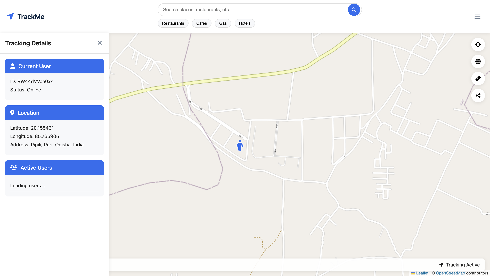
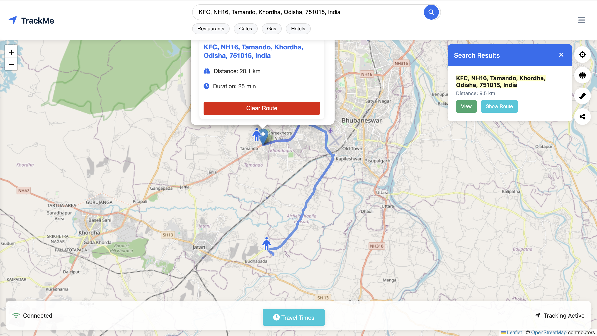

# Real-Time Tracker 📍

Track locations **live and in real-time** with a modern, interactive map interface.
**Real-Time Tracker** is a web app that lets users monitor movement, visualize routes, and stay updated using **live geolocation data**.

📂 **Repository:** [Real-Time-Tracker](https://github.com/RADXIshan/Real-Time-Tracker)

---

## ✨ Features

* 📡 **Live Location Tracking** – See users or devices moving in real time.
* 🗺 **Interactive Map** – Smooth, zoomable map with custom markers and routes.
* 🔄 **Automatic Updates** – Positions update dynamically without refreshing.

---

## 📸 Screenshots

| Map View                           | Route Tracking                            |
| ---------------------------------- | ---------------------------------------- |
|  |  |

---

## 🛠 Tech Stack

* **Frontend:** EJS, Vanilla CSS
* **Backend:** Node.js, Express.js, Socket.io (for real-time updates)
* **Map API:** Leaflet.js 
---

## 🚀 Getting Started

Run **Real-Time Tracker** locally:

```bash
# 1️⃣ Clone the repository
git clone https://github.com/RADXIshan/Real-Time-Tracker.git

# 2️⃣ Navigate into the project folder
cd Real-Time-Tracker

# 3️⃣ Install dependencies
npm install

# 4️⃣ Start the development server
npm run dev
```
---
